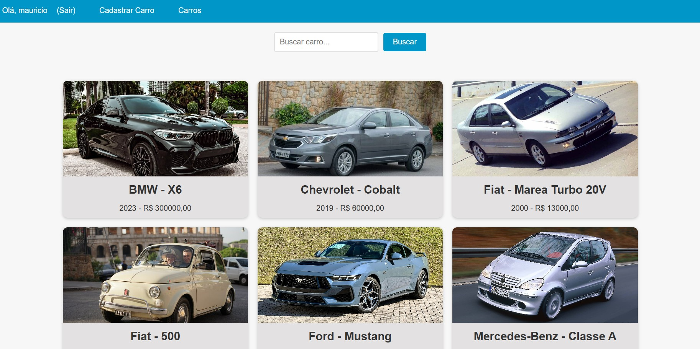
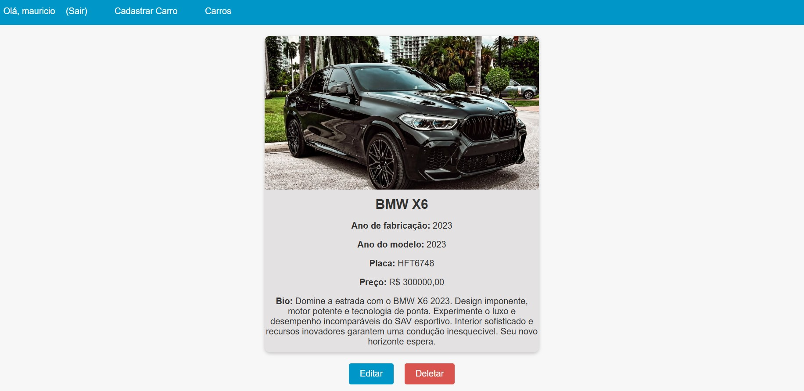
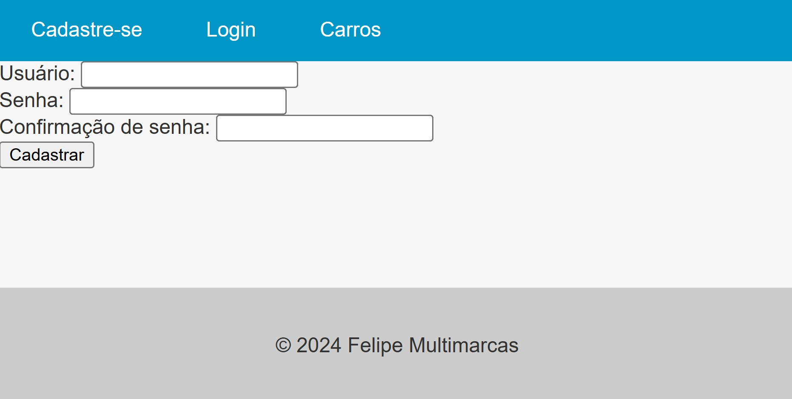
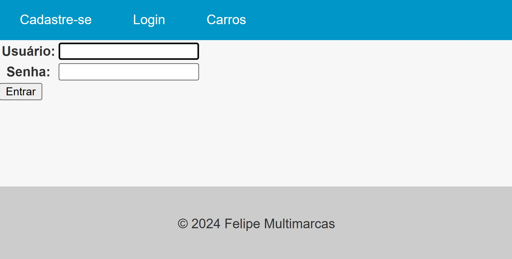
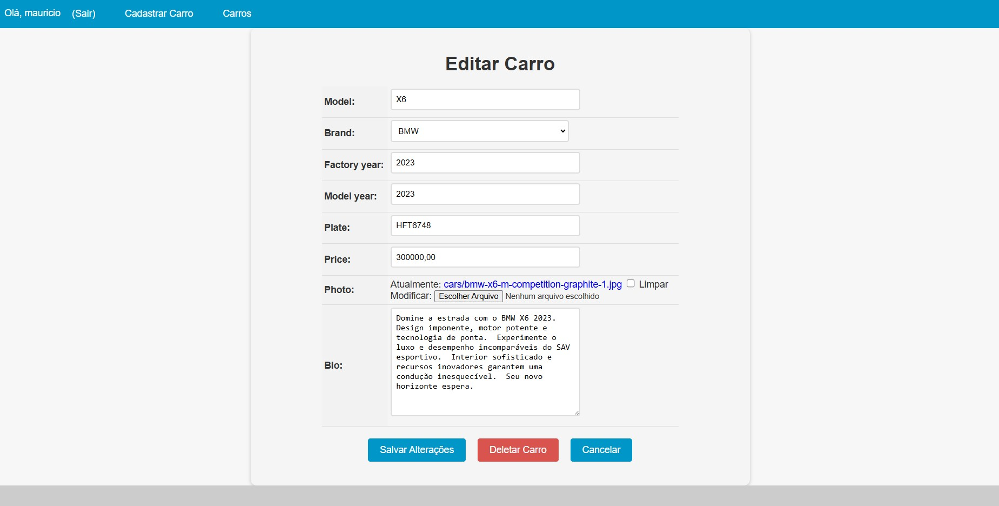

<h1 align="center" style="font-weight: bold;">Project Cars 💻</h1>

<p align="center">
 <a href="#technologies">Tecnologias</a> • 
 <a href="#started">Início</a> • 
 <a href="#routes">Endpoints</a> •
 <a href="#contribute">Contribuições</a>
</p>

<b>Project Cars é um catálogo de carros. Os usuários cadastrados podem cadastrar, editar e deletar carros.</b>

<h2 id="layout">🎨 Layout</h2>

<p align="center">
    
    
</p>

<h3>Funcionalidades</h3>

- Cadastro de usuários.

- Cadastro, edição e deleção de carros, com imagem e descrição.

- Uso da Gemini API para preenchimento automático da descrição do carro.

<h2 id="technologies">💻 Tecnologias</h2>

- Python ([Download](https://www.python.org/downloads/))
- Django
- HTML
- CSS
- PostgreSQL [Download](https://www.postgresql.org/download/)

<h2 id="started">🚀 Início</h2>

Para acessar o projeto, é necessário cloná-lo do repositório do Github, criar o ambiente virtual, ativá-lo e instalar as suas dependências nele.

<h3>Clonando o projeto</h3>

Vá para o terminal e clone o repositório do Github:

```bash
git clone https://github.com/felipe-rods/project_cars.git
```

<h3>Instalando e configurando o PostgreSQL</h3>

Antes de começar a utilizar o projeto, você precisa ter instalado e configurado o PostgreSQL como banco de dados em sua máquina. Para isso, siga as instruções no [site oficial do PostgreSQL](https://www.postgresql.org/download/).

Após instalar o PostgreSQL, crie um banco de dados e configure um usuário. Você pode usar os comandos abaixo no terminal do PostgreSQL:

```sql
CREATE DATABASE carros;
CREATE USER seu_usuario WITH PASSWORD 'sua_senha';
ALTER ROLE seu_usuario SET client_encoding TO 'utf8';
ALTER ROLE seu_usuario SET default_transaction_isolation TO 'read committed';
ALTER ROLE seu_usuario SET timezone TO 'UTC';
GRANT ALL PRIVILEGES ON DATABASE carros TO seu_usuario;
```

<h3>Criando e configurando o arquivo .env</h3>

1. <b>Criar o arquivo .env:</b> No diretório raiz do seu projeto, crie um arquivo chamado .env.

2. <b>Copiar o conteúdo de env.example:</b> Abra o arquivo env.example e copie todo o conteúdo dele para o novo arquivo .env.

3. <b>Substituir as informações necessárias:</b> No arquivo .env, substitua as informações de exemplo pelas credenciais reais do seu banco de dados e outras variáveis de ambiente necessárias. Por exemplo:

```env
GEMINI_API_KEY=your_API_key_here

DB_NAME=nome_do_banco
DB_USER=usuario_do_banco
DB_PASSWORD=sua_senha
DB_HOST=localhost
DB_PORT=5432
```

<h3>Criando e ativando o ambiente virtual</h3>

No mesmo terminal, vá para a página do projeto, crie e ative o ambiente virtual:

```bash
cd project_cars
python -m venv venv

source venv/bin/activate # Linux e macOS
./venv/Scripts/activate # Windows
```

<h3>Iniciando o projeto</h3>

Instale os requisitos do projeto:

```bash
pip install requirements.txt
```

Faça a migração do banco de dados:

```bash
python manage.py migrate
```

Então, ative o servidor:

```bash
python manage.py runserver
```

<h3>Endereço Base</h3>

Para acessar o projeto, use o seguinte endereço base:

```
http://localhost:8000/
```

<h3>Criando um superusuário (opcional)</h3>

Para acessar o painel administrativo do django, crie um superusuário:

```bash
python manage.py createsuperuser
```

Siga as instruções para definir o nome de usuário, e-mail e senha. Para acessar o painel administrativo, use o endpoint `admin/`.

<h2 id="routes">📍 Endpoints</h2>

- `cars/`
  - Descrição: página principal com a lista de carros.

<p align="center">

<p>

- `cars/register/`
  - Descrição: cadastro de novos usuários.

<p align="center">

<p>

- `cars/login/`
  - Descrição: entra como usuário cadastrado.

<p align="center">

<p>

- `cars/new_car/`
  - Descrição: cadastra um novo carro. Se a foto do novo carro não for cadastrada, automaticamente é inserida uma imagem de "sem foto". Caso a descrição não seja inserida, é feita automaticamente de acordo com o modelo e ano do carro, utilizando a Gemini API.

<p align="center">
    
</p>

- `cars/{id}/`
  - Descrição: retorna os detalhes de um carro específico.

<p align="center">
    
</p>

- `cars/{id}/update/`
  - Descrição: atualiza um carro existente (necessário ser cadastrado e estar logado).

<p align="center">

<p>

- `cars/{id}/delete/`
  - Descrição: exclui um carro existente (necessário ser cadastrado e estar logado).

<h2 id="contribute">📫 Contribuições</h2>

Agradecemos o seu interesse em contribuir! Siga estas etapas:

1. Faça um fork e clone o repositório:

```bash
git clone https://github.com/felipe-rods/project_cars.git
cd project_cars
```

2. Crie uma nova branch:

```bash
git checkout -b feature/NAME
```

3. Faça suas modificações e commits, seguindo um padrão:

```bash
git add .
git commit -m "Descrição do que foi alterado"
```

4. Envie para o Github:
```bash
git push origin nome-da-branch
```

5. Abra um Pull Request detalhando as suas modificações. Adicione uma captura de tela das mudanças e espere pela análise.

<h3>Documentações que podem ajudar</h3>

[📝 Como criar um Pull Request](https://docs.github.com/pt/pull-requests/collaborating-with-pull-requests/proposing-changes-to-your-work-with-pull-requests/creating-a-pull-request)

[💾 Padrões de commit](https://github.com/iuricode/padroes-de-commits)

<h3>Licença</h3>

Este projeto está licenciado sob a Licença MIT. Veja o arquivo LICENSE para mais detalhes.


